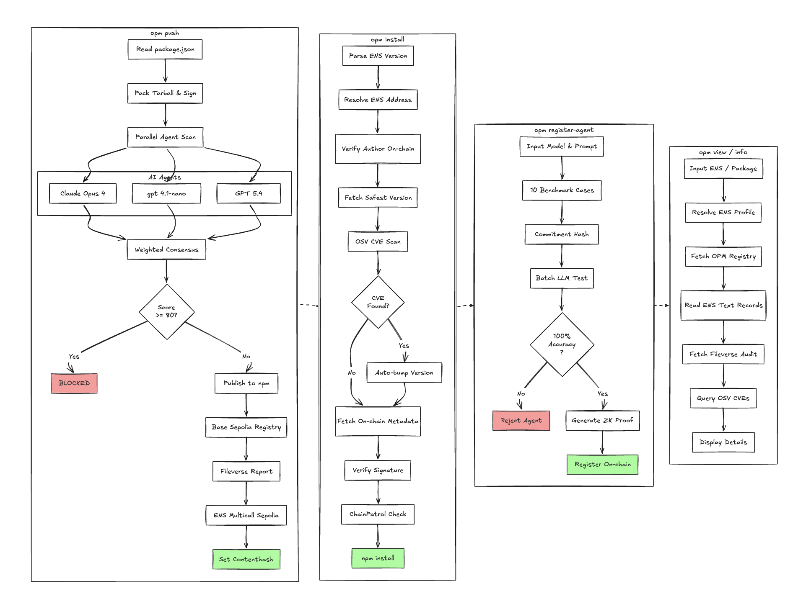

# OPM: On-chain Package Manager

[](https://www.npmjs.com/package/opmsec)
[](https://github.com/dhananjaypai08/opm)
[](https://sepolia.basescan.org/address/0x16684391fc9bf48246B08Afe16d1a57BFa181d48)

OPM is a drop-in npm replacement that adds **cryptographic signing**, **multi-agent AI security scanning**, **on-chain audit registries**, and **zero-knowledge agent verification** to the JavaScript supply chain.

Every package publish is scanned by 3 AI agents in parallel. Risk scores are submitted on-chain. Audit reports are stored encrypted on IPFS via Fileverse. Install-time checks verify signatures, query CVEs, and enforce risk thresholds — all from the terminal.

## System Design



## Quick Start

```bash
# Install globally
npm i -g opmsec

# Or clone and link
git clone https://github.com/dhananjaypai08/opm.git && cd opm
cp .env.example .env
bun install && bun link
```

## Commands

| Command | What it does |
|---------|-------------|
| `opm push` | Sign, scan with 3 AI agents, publish to npm, register on-chain, write ENS records |
| `opm install <pkg>` | Verify signature, check CVEs, query on-chain risk, then install |
| `opm install` | Bulk scan all package.json deps with ENS resolution and auto-bumping |
| `opm check` | Scan deps for typosquats, CVEs, and AI-detected risks |
| `opm fix` | Auto-patch typosquats and upgrade vulnerable versions |
| `opm info <pkg>` | On-chain metadata, ENS records, audit report, CVEs |
| `opm view <name.eth>` | Author profile, reputation, published packages |
| `opm register-agent` | Onboard a new AI agent with ZK-verified benchmarks |

Standard npm commands (`init`, `run`, `test`, `build`, `start`, etc.) pass through transparently.

## How It Works

### `opm push`

Pack tarball → SHA-256 checksum → ECDSA sign → resolve ENS → scan with 3 AI agents in parallel → weighted consensus → block if score ≥ 80 → publish to npm → register on-chain → upload report to Fileverse → write ENS text records → set IPFS contenthash from Fileverse contract.

### `opm install`

Parse ENS version (e.g. `pkg@name.eth`) → resolve author on-chain → get safest version → check CVEs → verify checksum + signature → ChainPatrol check → npm install. Auto-bumps to safer versions if CVEs or high risk detected.

### `opm register-agent`

Generate 10 benchmark cases → commit expected results → run candidate agent → compare actual vs expected → if 100% accuracy: generate ZK proof → register on-chain with proof hash. Agent becomes authorized to submit scores.

## AI Agents

Three models scan every publish in parallel. Diversity reduces single-model blind spots.

| Agent | Model (OpenRouter) | Fallback (OpenAI) |
|-------|-------------------|-------------------|
| agent-1 | Claude Sonnet 4 | GPT-4.1 |
| agent-2 | Gemini 2.5 Flash | GPT-4.1 Mini |
| agent-3 | DeepSeek Chat | GPT-4.1 Nano |

Scores are weighted by model intelligence + coding index from the Artificial Analysis API. Anyone can register additional agents permissionlessly via ZK-verified benchmarks.

## Smart Contract

`OPMRegistry.sol` on [Base Sepolia](https://sepolia.basescan.org/address/0x16684391fc9bf48246B08Afe16d1a57BFa181d48).

| Function | What it does |
|----------|-------------|
| `registerPackage` | Store version checksum, signature, ENS binding |
| `submitScore` | Agent submits risk score + reasoning |
| `setReportURI` | Attach Fileverse report link |
| `registerAgent` | Permissionless agent registration with ZK proof hash |
| `getSafestVersion` | Lowest-risk version in lookback window |
| `getPackageInfo` | Full metadata + aggregate score |

Every transaction surfaces as a clickable BaseScan link in the terminal.

## ENS Integration

Package metadata is written to ENS text records on the author's name:

`url` · `opm.version` · `opm.checksum` · `opm.fileverse` · `opm.risk_score` · `opm.packages` · `opm.signature` · `opm.contract`

Per-package records: `opm.pkg.<name>.version`, `opm.pkg.<name>.checksum`, etc.

Contenthash is set to the Fileverse IPFS CID (read directly from the Fileverse Portal smart contract on-chain).

Install with ENS: `opm install express@djpai.eth` resolves the author, verifies they're registered, and installs the safest on-chain version.

## Project Structure

```
packages/
  core/         Types, constants, ABI, prompts, model rankings, benchmarks
  contracts/    OPMRegistry.sol, Hardhat config, Circom ZK circuit
  scanner/      AI agent runner, LLM client, Fileverse upload, ZK verifier
  cli/          Ink terminal UI, commands, services
  web/          Next.js landing page
docs/           Mintlify documentation
```

## Environment Variables

**Required for `opm push`:**

| Variable | Purpose |
|----------|---------|
| `OPM_SIGNING_KEY` | Ethereum private key for package signing |
| `AGENT_PRIVATE_KEY` | Agent wallet for on-chain score submission |
| `OPENROUTER_API_KEY` or `OPENAI_API_KEY` | LLM access for AI agents |
| `FILEVERSE_API_KEY` | Report storage ([ddocs.new](https://ddocs.new) → Settings → Developer Mode) |

**Optional:**

| Variable | Default |
|----------|---------|
| `NPM_TOKEN` | npm automation token |
| `CONTRACT_ADDRESS` | `0x16684391fc9bf48246B08Afe16d1a57BFa181d48` |
| `CHAINPATROL_API_KEY` | Blocklist checks |

Client commands (`install`, `check`, `info`, `view`) work with zero config.

## Fileverse Setup

```bash
npx @fileverse/api --apiKey <YOUR_API_KEY>
```

Runs at `http://localhost:8001`. Reports are encrypted, synced to IPFS, and the content hash is stored on the Fileverse Portal smart contract.

## Links

- **npm**: [npmjs.com/package/opmsec](https://www.npmjs.com/package/opmsec)
- **GitHub**: [github.com/dhananjaypai08/opm](https://github.com/dhananjaypai08/opm)
- **Contract**: [BaseScan](https://sepolia.basescan.org/address/0x16684391fc9bf48246B08Afe16d1a57BFa181d48)
- **Docs**: [Mintlify](https://mintlify.com)

## License

MIT
